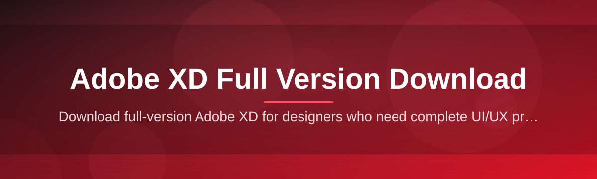
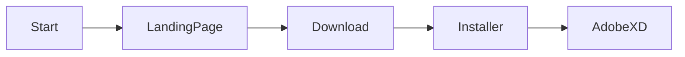

# adobe-xd-full-version-manager 🎨🚀

  

*Grab, manage, and launch your Adobe XD full version setup — without the runaround.*

  

## 🌐 Overview

**adobe-xd-full-version-manager** is a lightweight companion tool built for designers who just want their Adobe XD full version download handled cleanly, without digging through forums or sketchy mirror sites. Instead of hunting for scattered installer links, this project centralizes the whole retrieval-and-setup journey into one predictable workflow — point, fetch, install, design.

The Adobe XD ecosystem moved fast over the years, and version sprawl became a real headache: which build has the feature you need, which installer is current, which one actually finishes without hanging at 60%. This manager exists to smooth that out. It's a small, focused utility — not a bloated suite — aimed at solo designers, freelance UI/UX teams, and studios that need a repeatable way to get Adobe XD onto a fresh Windows machine.

Whether you're re-imaging a design workstation, onboarding a new teammate, or just tired of losing track of installer versions, this tool is built for you. No accounts, no telemetry dashboards, no nonsense — just a clean path from "I need Adobe XD" to "Adobe XD is running."

---

## ✨ What It Actually Does

**One-click retrieval.** The landing page hosts a single, current build so you're never guessing which download link is stale.

**Version clarity.** Every release is labeled plainly — no cryptic build numbers, no mystery patches.

**Zero-dependency runner.** The manager doesn't ask for extra frameworks, extra runtimes, or background services to work.

**Offline-friendly installer packaging.** Once downloaded, the installer runs standalone — great for locked-down or air-gapped design rigs.

**Clean uninstall paths.** Removing Adobe XD after the manager sets it up leaves no orphaned registry clutter behind.

**Lightweight footprint.** The tool itself is a few megabytes — it's a doorway, not a warehouse.

**Consistent UI across runs.** Same layout, same flow, every single time you launch it — muscle memory kicks in fast.

**Update awareness.** The landing page reflects the current 2026 build so you're not stuck on an outdated Adobe XD full version download.

> [!NOTE]
> This project is a **retrieval and setup manager**, not a modified build of Adobe XD. It points you to the official installer package and streamlines the local setup experience.

---

## 🏁 Up and Running

Getting Adobe XD onto your machine takes four short steps:

1. **Visit the landing page** — tap the download button above to open the project site.

2. **Grab the installer** — the page always serves the current 2026 packaged build.

3. **Run the setup file** — launch it like any standard Windows `.exe`, follow the on-screen prompts.

4. **Open Adobe XD** — once setup finishes, your design workspace is ready to go.

> [!TIP]
> Run the installer with administrator rights if your organization's Windows policy restricts standard app installs. It avoids most permission-denied errors right out of the gate.

---

## 🖥️ System Requirements

| Component | Minimum | Recommended |
|---|---|---|
| **OS** | Windows 10 (64-bit) | Windows 11 (64-bit) |
| **RAM** | 8 GB | 16 GB |
| **Storage** | 2 GB free | 5 GB free |
| **Display** | 1280x800 | 1920x1080 |
| **GPU** | DirectX 10 compatible | Dedicated GPU |
| **Dependencies** | None required | None required |

> [!IMPORTANT]
> This manager is **Windows-only**. There's no macOS build planned for this release cycle — the packaging pipeline is tuned specifically for Windows installer formats.

---

## ⚙️ How It Works

The whole pipeline is intentionally short:

1. You open the landing page and trigger the download.

2. The manager verifies the package integrity before handing it off.

3. Windows runs the standalone installer with no extra services required.

4. Adobe XD registers itself locally and becomes launch-ready.

---

## 🧩 Troubleshooting

**Q: The installer downloaded but Windows flags it as unrecognized.**
A: This is common for newer, lower-reputation installers. Click "More info" then "Run anyway" if you trust the source.

**Q: Setup freezes partway through.**
A: Temporarily disable third-party antivirus real-time scanning — some scanners intercept large installer writes and stall them.

**Q: Adobe XD launches but the workspace looks blank.**
A: Update your GPU drivers. XD's canvas rendering leans on hardware acceleration, and outdated drivers can cause blank panels.

**Q: I don't see the newest version on the landing page.**
A: Hard-refresh the page (`Ctrl+F5`) — cached pages sometimes hold onto an older badge state.

**Q: Antivirus quarantines the installer immediately.**
A: Whitelist the download folder temporarily during setup, then re-enable full scanning afterward.

---

## 🎛️ UI & UX Details

<strong>Keyboard shortcuts worth memorizing</strong>

| Action | Shortcut |
|---|---|
| Open landing page in default browser | `Ctrl+L` (via desktop shortcut, if created) |
| Cancel active download | `Esc` |
| Retry failed download | `Ctrl+R` |
| Open install log | `Ctrl+Shift+L` |

- **Themes**: The landing page respects your system's light/dark preference automatically.
- **Settings**: Minimal by design — there's no settings sprawl to manage, just a download and a status readout.
- **Progress feedback**: Clear percentage-based download progress, no ambiguous spinners.

> [!WARNING]
> Closing the browser tab mid-download will interrupt the transfer. Reopen the landing page and restart the download rather than trying to resume a partial file manually.

---

## 🤝 Contributing & Community

Pull requests, issue reports, and discussion threads are all welcome. A few quick guidelines:

- Keep PRs focused — one fix or one feature per request.

- Use the issue templates when reporting installer or landing-page bugs.

- Be respectful in discussions — this is a community-maintained project, not a corporate support channel.

> Star the repo if it saved you a headache — it genuinely helps visibility for other designers searching for a reliable Adobe XD full version download path.

  

---

## 📄 License

Released under the [MIT License](LICENSE), 2026.

---

## ⚠️ Disclaimer

> [!CAUTION]
> This project is an independent, community-built manager and is **not affiliated with, endorsed by, or sponsored by Adobe Inc.** "Adobe XD" is a trademark of Adobe Inc. This tool simply streamlines access to the official installer package via the linked landing page — it does not modify, redistribute altered binaries, or provide unauthorized licensing of any kind. Use in accordance with Adobe's own terms of service.

